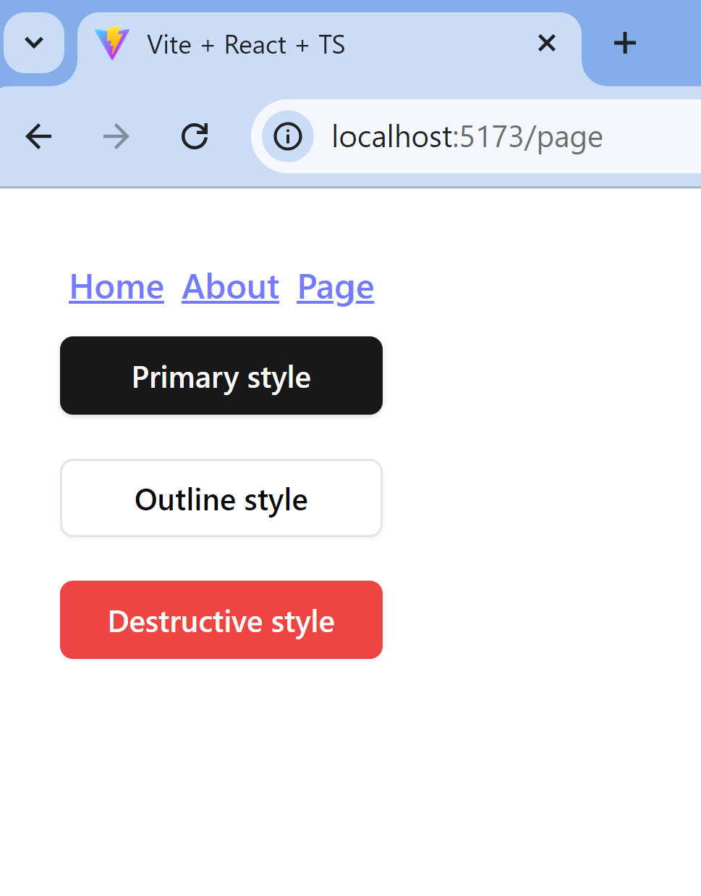

## Adgo Frontend Onboarding

This project is a basic React application using Vite and TypeScript, with React Router for navigation and React Query for handling API calls.

### Features

- A layout component that includes a navbar with navigation links and an <Outlet /> component for rendering child routes.
- GET Request: A route/page that makes a GET request using useQuery().
- Handles loading, error, and data states.
- POST Request: A separate route/page with a form for making a POST request using useMutation().
- Handles pending and error states during submission.

### Setup Instructions

```
  git clone https://github.com/Rediet-W/adgo-frontend-onboarding.git
  cd adgo-frontend-onboarding
  npm install
  npm run dev

```

### Screenshots

success


pending


Error


Home page


About


Page

